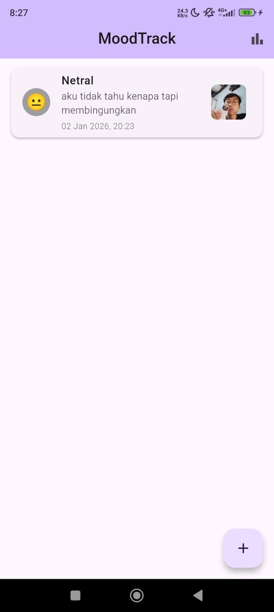
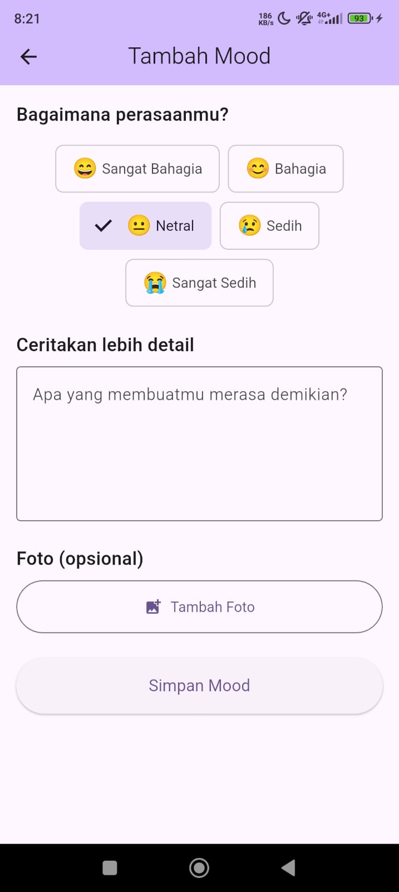
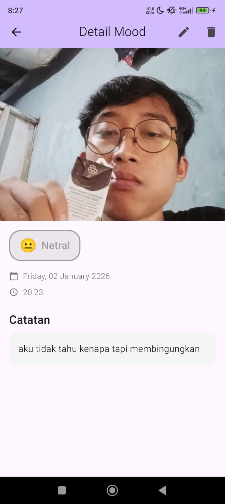
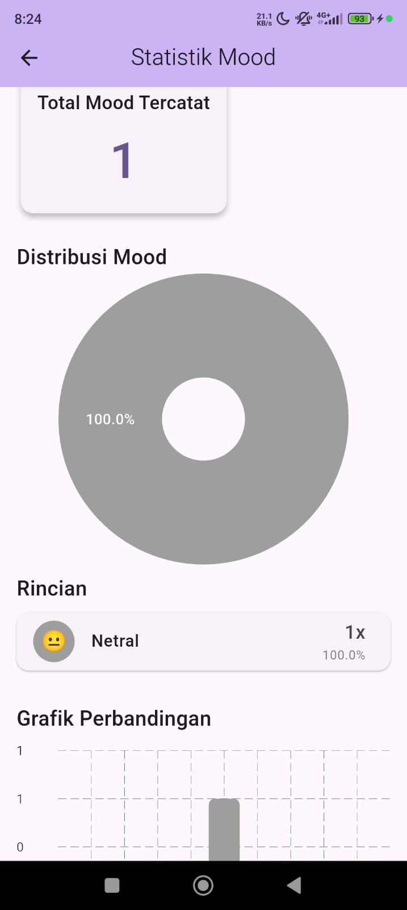

# MoodTrack - Aplikasi Pelacak Mood


## 📱 Deskripsi Aplikasi

**MoodTrack** adalah aplikasi mobile berbasis Flutter untuk mencatat dan melacak mood harian. Aplikasi ini membantu pengguna memahami pola emosional dengan fitur pencatatan lengkap, visualisasi data, dan integrasi kamera.

### Fitur Utama:

- ✅ **CRUD Operations** - Create, Read, Update, Delete mood entries
- ✅ **SQLite Database** - Penyimpanan data lokal yang persistent
- ✅ **Camera Integration** - Ambil foto dari kamera atau galeri
- ✅ **Data Visualization** - Pie Chart dan Bar Chart untuk statistik mood
- ✅ **State Management** - Menggunakan Provider pattern

## 📸 Screenshots

| Home Screen | Add Mood | Detail Screen |
|-------------|----------|---------------|
|  |  |  |

| Statistics Screen | Camera Integration |
|-------------------|--------------------|
|  |  |
| .jpeg) | .jpeg) |

*Tampilan utama aplikasi menampilkan list mood, form input dengan camera integration, detail mood, dan visualisasi statistik dengan charts.*

## Database Schema

```sql
CREATE TABLE moods (
  id INTEGER PRIMARY KEY AUTOINCREMENT,
  mood TEXT NOT NULL,
  note TEXT NOT NULL,
  date TEXT NOT NULL,
  imagePath TEXT
);
```🗄️ Database Schema

### Table: `moods`

| Column | Type | Constraint | Description |
|--------|------|------------|-------------|
| `id` | INTEGER | PRIMARY KEY AUTOINCREMENT | Unique identifier |
| `mood` | TEXT | NOT NULL | Jenis mood (Sangat Bahagia, Bahagia, Netral, Sedih, Sangat Sedih) |
| `note` | TEXT | NOT NULL | Catatan detail tentang mood |
| `date` | TEXT | NOT NULL | Timestamp dalam format ISO 8601 |
| `imagePath` | TEXT | NULL | Path lokasi foto (opsional) |

**SQL Schema:**
```sql
CREATE TABLE moods (
  id INTEGER PRIMARY KEY AUTOINCREMENT,
  mood TEXT NOT NULL,
  note TEXT NOT NULL,
  date TEXT NOT NULL,
  imagePath TEXT
);
  provider: ^6.1.1
  
  # Local Database
  sqflite: ^2.3.0
  path_provider: ^2.1.1
  path: ^1.9.0
  
  # Date & Time
  intl: ^0.19.0
  
  # Charts
  fl_chart: ^0.65.0
  
  # Camera & Images
  image_picker: ^1.0.7
```🔧 Download APK

**Link APK untuk Testing:**
📥 [Download MoodTrack APK](https://drive.google.com/drive/folders/1ZC6QE43weOEBnghYGV56npAK_eLCpEeV?usp=sharing)

*Catatan: Upload file APK Anda ke Google Drive atau hosting lainnya, kemudian update link di atas.*

**Cara Build APK:**
```bash
flutter build apk --release
```
File APK akan tersedia di: `build/app/outputs/flutter-apk/app-release.apk **Jalankan Aplikasi**
   ```bash
   flutter run
   ```
🚀 Cara Menjalankan Aplikasi

### Prerequisites:
- Flutter SDK 3.9.2 atau lebih baru
- Dart SDK 3.0+
- Android Studio / VS Code dengan Flutter extension
- Android Emulator atau device fisik

### Langkah-langkah:

1. **Clone Repository**
   ```bash
   git clone <repository-url>
   cd moodtrack
   ```

2. **Install Dependencies**
   ```bash
   flutter pub get
   ```

3. **Jalankan Aplikasi**
   ```bash
   flutter run
   ```

### Build APK/AAB:

**APK (untuk testing):**
```bash
flutter build apk --release
```

**App Bundle (untuk Google Play):**
```bash
flutter build appbundle --release
```

### Troubleshooting:

Jika ada error, jalankan:
```bash
flutter clean
flutter pub get
maxWidth: 1080,
  imageQuality: 85,
);
```

### 4. **Data Visualization**
Charts dengan fl_chart:
- PieChart untuk distribusi mood
- BarChart untuk perbandingan jumlah

## API Documentation
📚 API Documentation

### MoodProvider (State Management)

**Main Methods:**

| Method | Parameter | Return | Description |
|--------|-----------|--------|-------------|
| `loadMoods()` | - | `Future<void>` | Load semua mood dari database |
| `addMood()` | `MoodEntry` | `Future<void>` | Tambah mood baru |
| `updateMood()` | `MoodEntry` | `Future<void>` | Update mood existing |
| `deleteMood()` | `int id` | `Future<void>` | Hapus mood berdasarkan ID |
| `getMoodStatistics()` | - | `Future<Map<String, int>>` | Get statistik mood |

### DatabaseHelper (SQLite Operations)

**CRUD Methods:**

| Method | Parameter | Return | Description |
|--------|-----------|--------|-------------|
| `create()` | `MoodEntry` | `Future<MoodEntry>` | Insert mood ke database |
| `readMood()` | `int id` | `Future<MoodEntry?>` | Get mood by ID |
| `readAllMoods()` | - | `Future<List<MoodEntry>>` | Get semua mood (DESC by date) |
| `update()` | `MoodEntry` | `Future<int>` | Update mood existing |
| `delete()` | `int id` | `Future<int>` | Delete mood by ID |

### MoodEntry Model

**Fields:**
```dart
class MoodEntry {
  final int? id;
  final String mood;        // "Sangat Bahagia", "Bahagia", "Netral", "Sedih", "Sangat Sedih"
  f👨‍💻 Informasi Pengembang

**Nama:** Deva Ananda Revansa Pradana  
**NIM:** A11.2022.14519  
**Mata Kuliah:** Pemrograman Mobile Flutter  
**Tahun Akademik:** 2025/2026

---

## 📄 License

MIT License - Project ini dibuat untuk keperluan pembelajaran.

---

**© 2026 MoodTrack - Capstone Project Pemrograman Mobile Flutter**